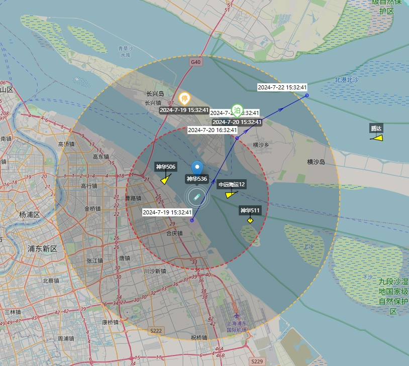

# Arrow 海图 SDK

基于 Leaflet 构建的地图 SDK。


## 接口介绍

1. 初始化

```
const map = new MyMap("map");
```

2. 绘制船舶 [drawShips]

```
map.drawShips([
    {
      mmsi: "1120154506",
      label: "神华506",
      lng: 121.705,
      lat: 31.3,
      course: 45,
      updatetime: "2024-5-31",
      width: 60,
      length: 110,
    },
  ]);
```

3. 绘制轨迹线 [drawTrajectory]

```
map.drawTrajectory([
  { lat: 31.254086, lng: 121.742848, ts: "2024-7-19 15:32:41" },
  { lat: 31.254086, lng: 121.743048, ts: "2024-7-19 16:00:41" },
  { lat: 31.35, lng: 121.805, ts: "2024-7-20 16:32:41" },
  { lat: 31.37, lng: 121.835, ts: "2024-7-21 18:32:41" },
  { lat: 31.4, lng: 121.9, ts: "2024-7-22 15:32:41" },
])
```

4. 播放轨迹动画 [playAnimatedMarker]

```
 map.playAnimatedMarker(
    {
      points: historyLines,
      totalDuration: 10000,
    },
    {
      iconSize: [38, 26],
      iconAnchor: [19, 13],
      iconUrl: icon,
    },
    null, // 每帧动画渲染的回调
    () => {
      // 动画结束
    }
  );
```

5. 暂停轨迹动画 [pauseAnimatedMarker]

```
 map.pauseAnimatedMarker(true);
```

6. 绘制靠泊点 [drawPointMarkers]

```
 map.drawPointMarkers([
    {
      lat: 31.374086,
      lng: 121.732848,
      text: "2024-7-19 15:32:41",
      icon: stop1Png,
    },
    { lat: 31.36, lng: 121.805, text: "2024-7-20 15:32:41", icon: stop2Png },
  ]);
```

7. 绘制 HTML 浮层[drawHtmlOverlay]

```
map.drawHtmlOverlay(
    [31.28, 121.75],
    `<div class="layer"><div class="name">神华536</div><div class="triangle"></div></div>`
  );
```

8. 创建聚合 Marker [createMarkerClusterer]

```
  map
    .createMarkerClusterer(
      (o) => {
        // 错位布局时html模板
        return `<div
          class="marker"
          style='
            transform: translateX(${
              o.reverse ? "calc(-50% + 14px)" : "calc(50% - 14px)"
            });
            flex-direction: ${o.reverse ? "row-reverse" : "row"}
          '
        >
          
          <div class="label" style='flexDirection: ${
            o.reverse ? "row-reverse" : "row"
          }'>
            <div>${o.key}</div>
          </div>
        </div>`;
    })
    .markerClustererSetData(source);
```

9. 绘制原生标记点 [drawMarker]  
   默认蓝色图标

```
map.drawMarker({ lat: 31.3, lng: 121.75 });
```

10. 绘制原生折线 [drawPolyline]

```
map.drawPolyline([{ lat: 31.3, lng: 121.75 },{ lat: 31.4, lng: 121.75 }]);
```

11. 绘制原生多边形 [drawPolygon]

```
map.drawPolygon([{ lat: 31.3, lng: 121.75 },{ lat: 31.4, lng: 121.75 },{ lat: 31.5, lng: 121.75 }]);
```

12. 开启鼠标绘制折线 [startDrawPolyline]

- 双击选中图形，Delete 键删除

```
map.startDrawPolyline(({ id, latLngs, show, toggle, remove }) => {});
```

13. 开启鼠标绘制多边形 [startDrawPolygon]

- 双击选中图形，Delete 键删除

```
map.startDrawPolygon(({ id, latLngs, show, toggle, remove }) => {});
```

14. 开启测量 [startDrawMeasure]

- 双击选中图形，Delete 键删除

```
map.startDrawMeasure();
```

15. 销毁 [destory]

```
map.destory()
```
